# End-to-End Data Engineering Pipeline on Azure

An end-to-end data engineering project built using Microsoft Azure services to ingest, process, transform, and serve data for analytics and reporting.

The project uses the AdventureWorks dataset as the source and implements a layered data pipeline using Azure Data Factory, Azure Data Lake Storage, Azure Databricks, Azure Synapse Analytics, and Power BI.

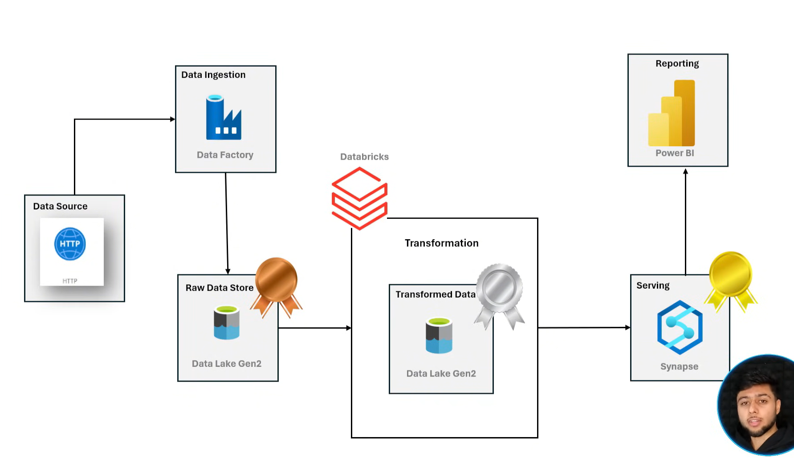

---

## Project Overview

The objective of this project was to build a complete cloud-based data engineering workflow that takes raw data from an external source, stores it in a data lake, transforms it using distributed processing, and makes the processed data available for analytical reporting.

The pipeline follows a layered approach:

**Source → Raw/Bronze → Transformation/Silver → Analytics/Gold → Power BI**

The main Azure services used in the project are:

- **Azure Data Factory** – pipeline orchestration and data ingestion
- **Azure Data Lake Storage Gen2** – storage for different data layers
- **Azure Databricks** – data processing and transformation
- **Azure Synapse Analytics** – querying and analytical data serving
- **Power BI** – visualization and reporting

---

## Technology Stack

| Technology | Purpose |
|---|---|
| Azure Data Factory | Data ingestion and orchestration |
| Azure Data Lake Storage Gen2 | Data lake and layered storage |
| Azure Databricks | Data transformation and processing |
| Azure Synapse Analytics | Analytical querying and data serving |
| Power BI | Reporting and visualization |
| Git / GitHub | Source control and project documentation |

---

## Architecture

The solution is organized into multiple stages, with each service handling a specific part of the data engineering workflow.

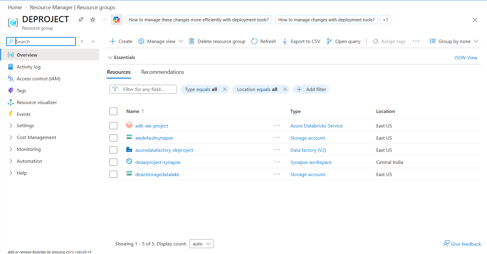

### Data Flow

1. Data is ingested from the external source using Azure Data Factory.
2. The raw data is stored in the Raw/Bronze layer of Azure Data Lake Storage.
3. Azure Databricks reads the raw data and performs the required transformations.
4. The transformed data is stored in the Silver layer in an optimized format.
5. Azure Synapse Analytics is used to query and serve the processed data.
6. The resulting data is organized into the Gold layer for analytics.
7. Power BI consumes the processed data to create analytical reports.

---

## Data Ingestion with Azure Data Factory

Azure Data Factory is used as the orchestration layer of the pipeline.

I implemented a parameterized ingestion pipeline that retrieves data from the source and dynamically moves it into the Raw/Bronze layer of the data lake.

The pipeline uses:

- HTTP-based data ingestion
- Parameterized datasets
- Dynamic pipeline configuration
- Lookup activity
- ForEach activity
- Dynamic Copy Activity

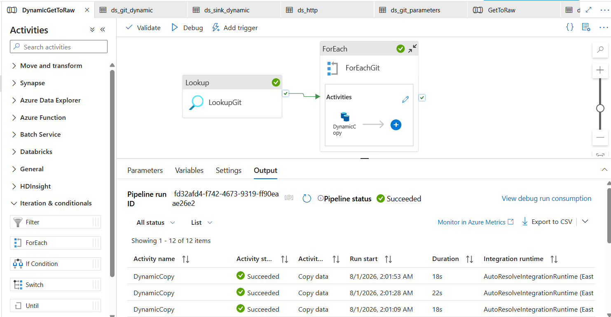

The raw data is stored in the data lake before any transformation is applied.

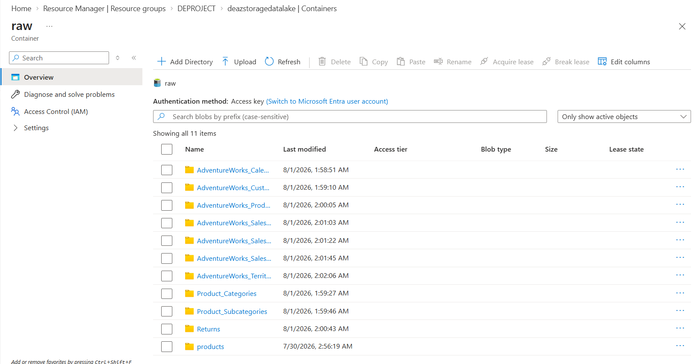

This separation keeps the original source data available for downstream processing and reprocessing when required.

---

## Data Transformation with Azure Databricks

Azure Databricks is used as the processing layer of the pipeline.

I configured a Databricks environment to access the raw data from Azure Data Lake Storage and perform the required transformations.

### Processing Workflow

The transformation process includes:

- Reading raw data from the data lake
- Data cleaning and filtering
- Data type and date normalization
- Transforming the source data into an analytics-friendly structure
- Writing the processed output back to the data lake

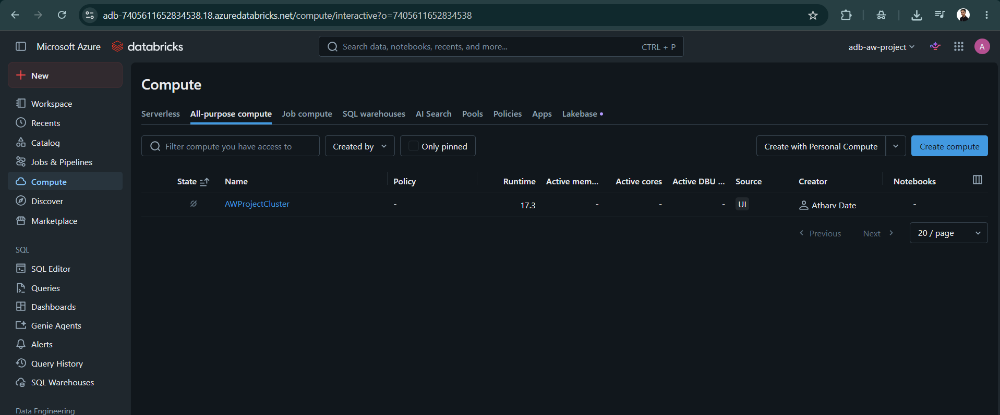

The transformation logic is implemented through a Databricks notebook/script.

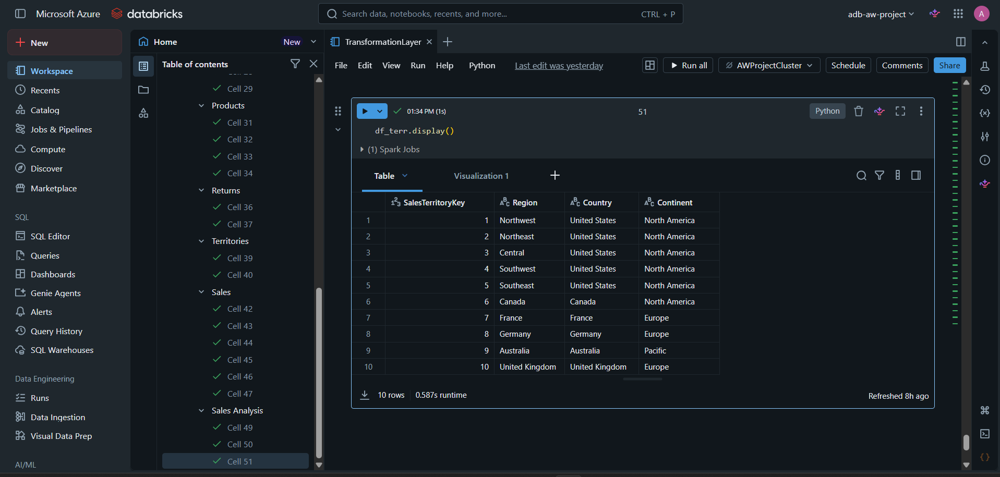

The processed data is then written to the Silver layer.

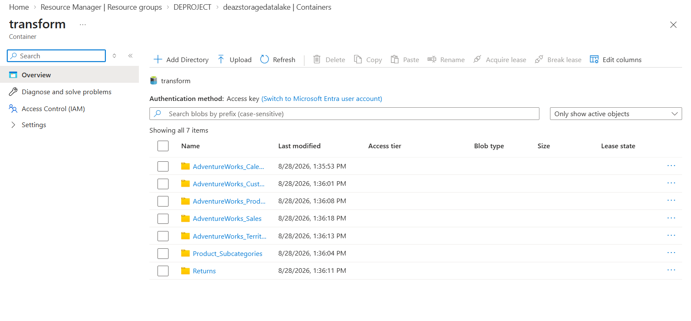

Parquet is used for the transformed data to provide a more efficient format for downstream analytical workloads.

---

## Data Serving with Azure Synapse Analytics

Azure Synapse Analytics is used to provide an analytical layer over the processed data.

I configured Synapse to work with the data stored in Azure Data Lake Storage and created the required database objects for querying and analysis.

The implementation includes:

- Synapse workspace configuration
- Serverless SQL querying
- Database and schema creation
- External data access
- SQL-based data analysis

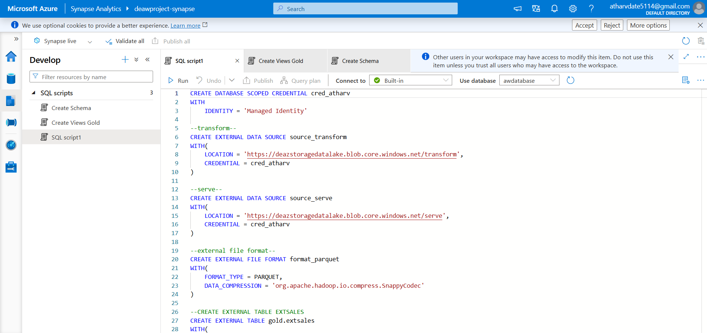

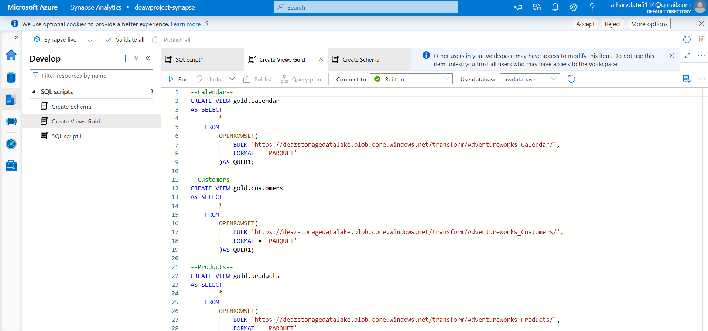

The processed data is organized into the Gold layer to provide a curated dataset for reporting and analytical consumption.

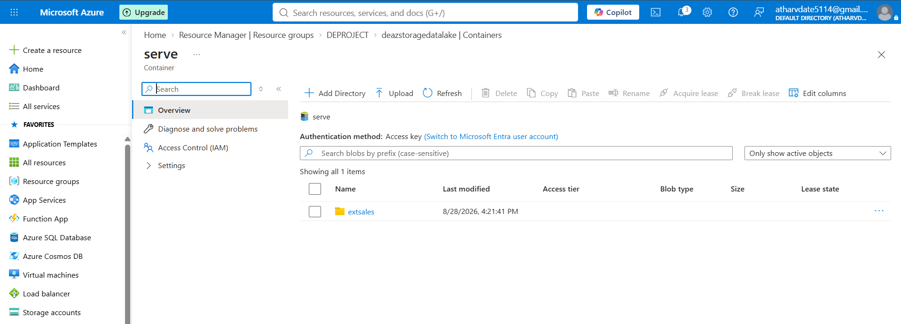

---

## Business Intelligence

Power BI is used as the final consumption layer of the pipeline.

The processed data is connected to Power BI to create dashboards and visualizations that allow the data to be analyzed from a business perspective.

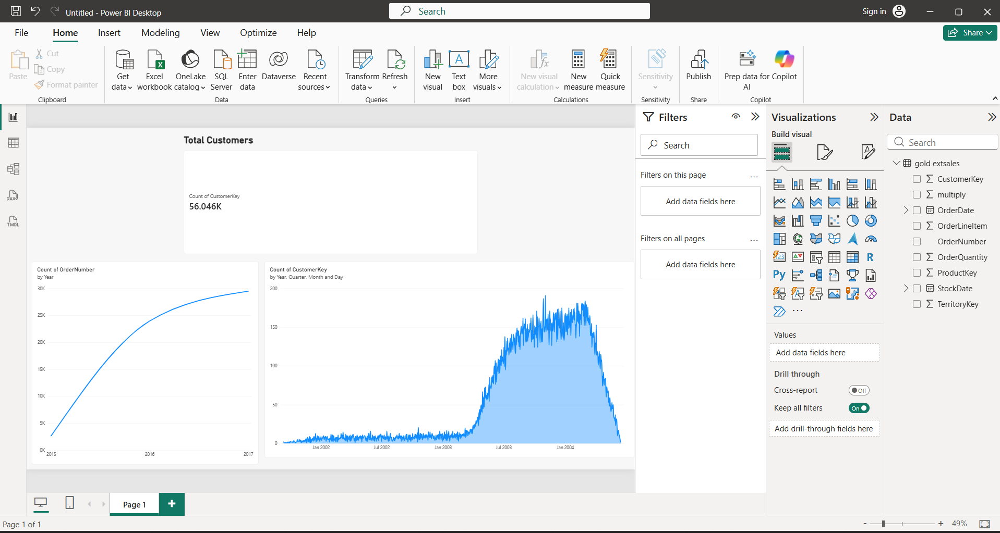

This completes the pipeline from raw source data to an end-user analytics layer.

---
